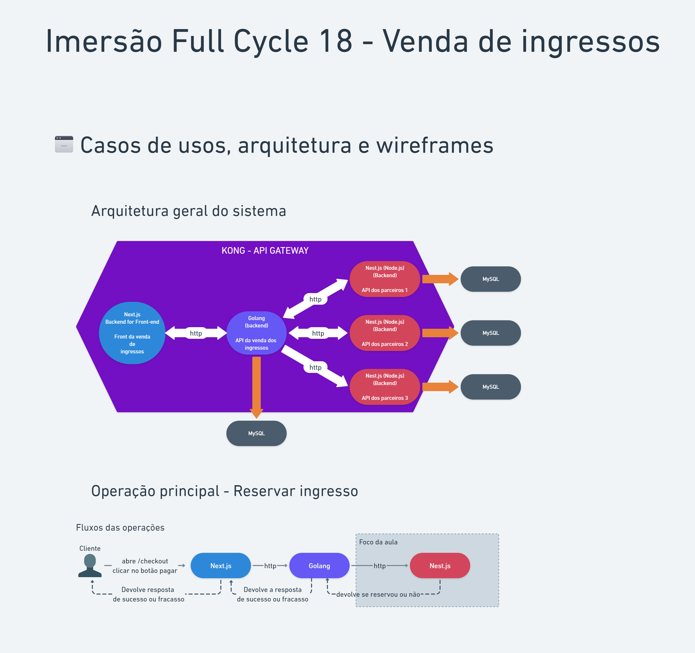

# Ticket Reservation System - Imersão Full Stack && Full Cycle 18

> Based on "Imersão Full Stack && Full Cycle 18" | https://imersao.fullcycle.com.br/evento/ | https://github.com/devfullcycle/imersao18

## Project organization and architecture

- **Partners API**: NestJS REST applications to manage reservation on each partner
- **Sales API**: Go REST application connected to **Partners API** to manage requests from **Web Interface**
- **Web Interface**: Next.js web application connected to **Sales API**
- **API-Gateway**: Kong application to manage API hosts/routes/headers/etc



## Running the project

```sh
docker-compose up
```

Next.js app will be running on http://localhost:8000/nextjs-web-app
